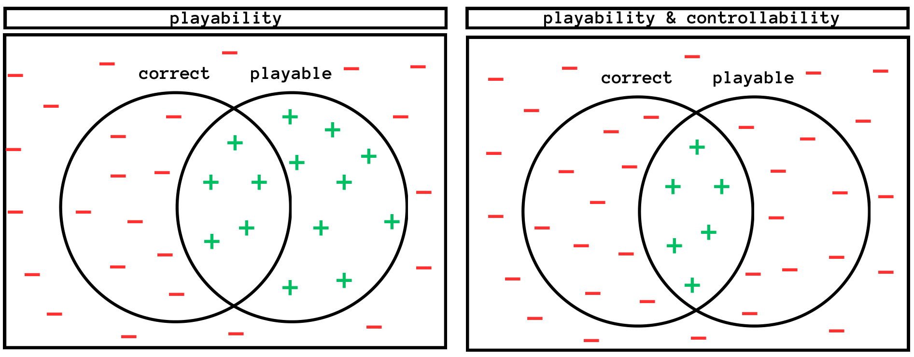

# Abstract

Generative Adversarial Networks (GANs) are unsupervised models designed to learn and replicate a target distribution. The vanilla versions of these models can be extended to more controllable models. Conditional Generative Adversarial Networks (CGANs) extend vanilla GANs by conditioning both the generator and discriminator on some additional information (labels). Controllable models based on complementary learning, such as Rumi-GAN, have been introduced. Rumi-GANs leverage negative examples to enhance the generator's ability to learn positive examples. We evaluate the performance of two controllable GAN variants, CGAN and Rumi-GAN, in generating game levels targeting specific constraints of interest in the context of two 2D tile-based games: playability and controllability. This evaluation is conducted under two scenarios: with and without the inclusion of negative examples. The goal is to determine whether incorporating negative examples helps the GAN models avoid generating undesirable outputs. Our findings highlight the strengths and weaknesses of each method in enforcing the generation of specific conditions when generating outputs based on given positive and negative examples.

# Experiments
We conducted two different experiments to examine two sets of constraints we would like to see in the generated levels: playability and controllability. A playable level is a level such that there exists a path between the level's start and end locations. Controllability is derived from the correctness of the number of controlled features (eg. pipes or treasures) at each level. A level is considered correct if it has the desired number of features. Figure below shows the Venn diagram of the sample space. The sample space is divided into playable-correct, playable-incorrect,unplayable-correct, and unplayable-incorrect subspaces. Positive and negative samples are chosen from these subspaces according to the model's objective. In the experiments, negative examples are added in addition to the positive data that models utilize. 



# Reference
You can find the full version of the paper on [Arxiv](https://arxiv.org/abs/2410.23108).

If you found this code useful, please consider citing our work:
```
@article{bazzaz2024controllable,
  title={Controllable Game Level Generation: Assessing the Effect of Negative Examples in GAN Models},
  author={Bazzaz, Mahsa and Cooper, Seth},
  journal={arXiv preprint arXiv:2410.23108},
  year={2024}
}